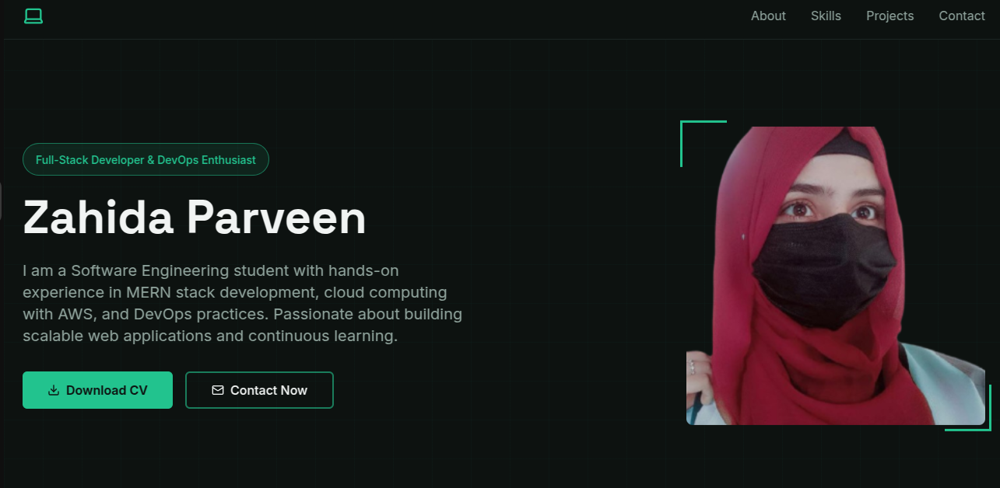
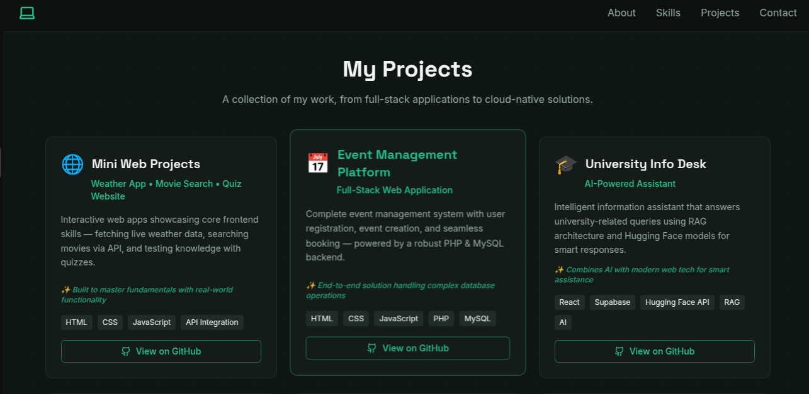
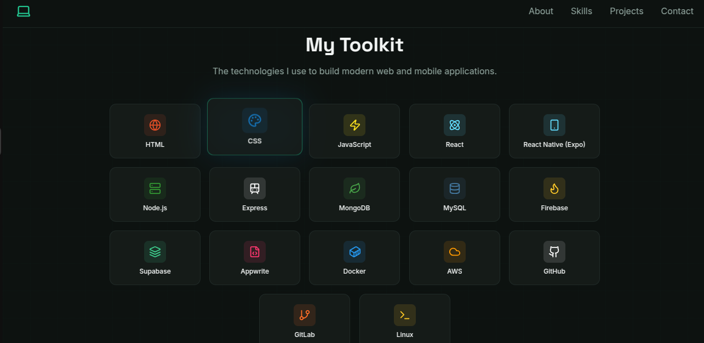

# Zahida's Portfolio

Welcome to my personal portfolio! This project showcases my skills, projects, and experience as a Software Engineering student with a focus on web development, cloud computing, and DevOps.

---

## 🚀 Project Overview

This portfolio website is designed to:
- Highlight my **technical skills** in MERN stack development, AWS, and DevOps practices.
- Showcase my **projects**, online teaching experience, and contributions.
- Serve as a professional online presence for potential employers and collaborators.

---

## 💻 Features

- Responsive and modern web design
- Interactive sections for **projects, skills, and mentoring experience**
- Smooth scrolling and navigation
- Meta tags for **SEO and social media previews**
- Favicon for browser tab branding

---

## 🖼 Screenshots

Here’s a quick preview of the portfolio:

  
  


---

## 🛠 Tech Stack

- **Frontend:** HTML, CSS, JavaScript
- **Frameworks/Libraries:** React / Bootstrap (if used)
- **Hosting / Deployment:** Static website hosting (GitHub Pages, Netlify, etc.)
- **Cloud / DevOps:** AWS (S3, CloudFront, IAM), Git & GitHub

---

## ⚡ Setup Instructions

1. **Clone the repository**
```bash
git clone https://github.com/yourusername/portfolio.git
cd portfolio
npm install
npm run dev

---